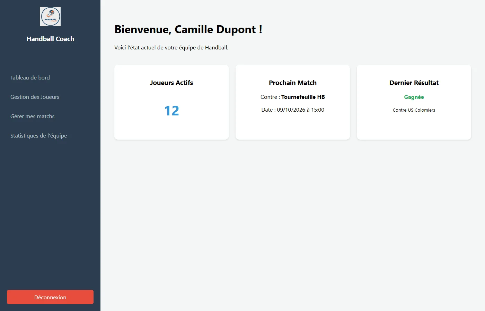
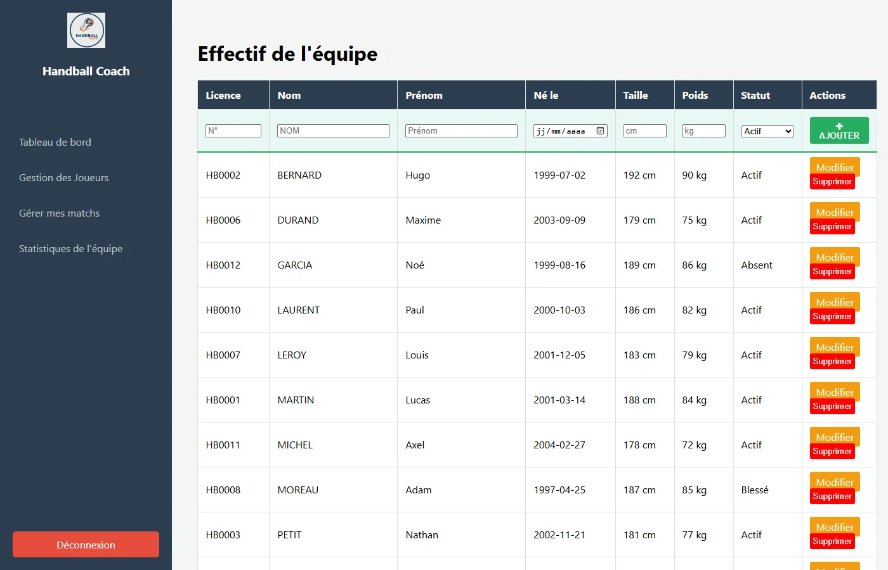
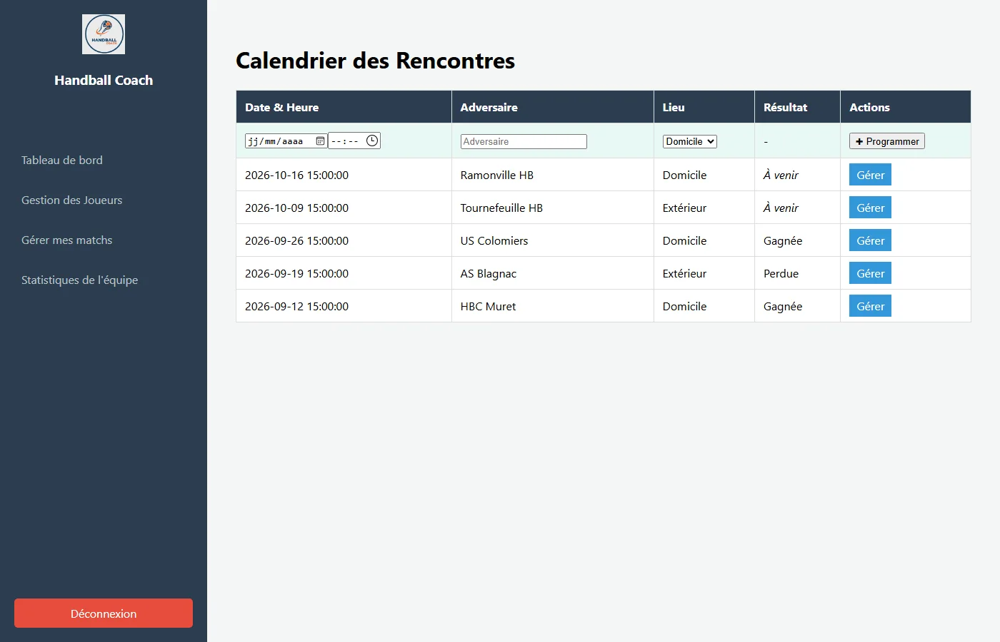
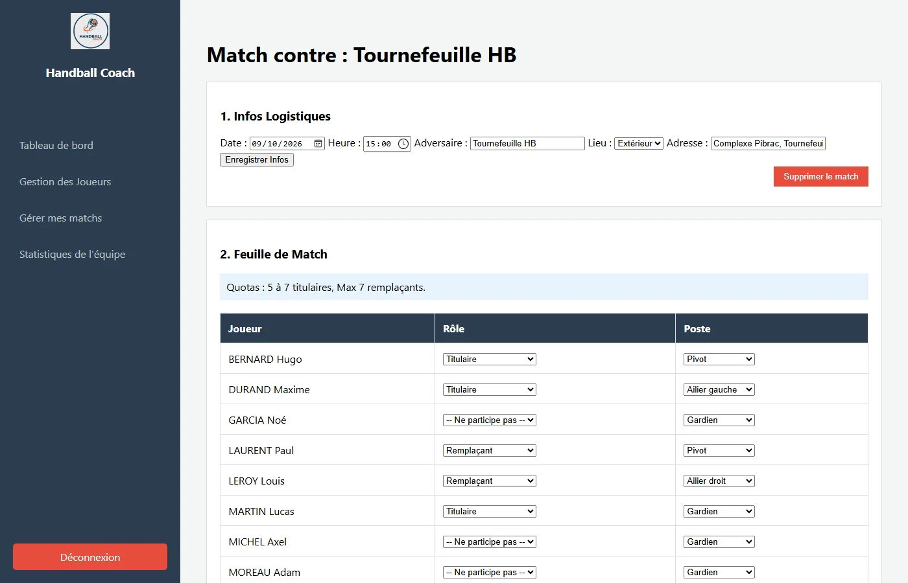
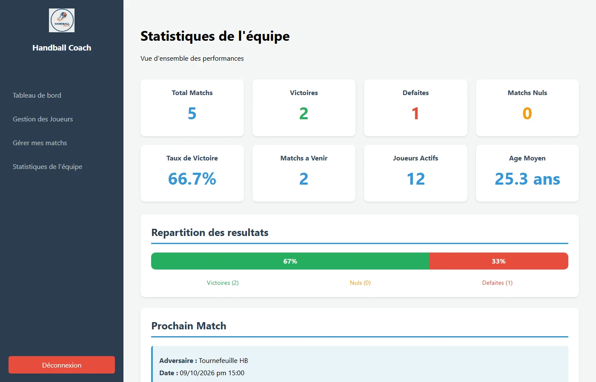

# Interface web de gestion d'équipe de handball (PHP)

> **Projet étudiant** réalisé à l'IUT de Toulouse (BUT Informatique, 2e année, modules R3.01 puis R4.01). C'est l'interface d'un projet de gestion d'équipe de handball. Une version corrigée, regroupée avec l'API d'authentification et l'API de gestion et prête à lancer, est dans le dépôt [`projetphpgestionjoueurs-matchs`](https://github.com/Yoann31310/projetphpgestionjoueurs-matchs). Ce dépôt garde l'historique d'origine de l'interface.

Application web pour un entraîneur de handball : gérer ses **joueurs**, programmer ses **matchs**, composer la **feuille de match** (titulaires, remplaçants, postes), noter les joueurs après la rencontre et consulter des **statistiques**.

## Captures d'écran

| Tableau de bord | Joueurs |
|---|---|
|  |  |

| Matchs | Feuille de match |
|---|---|
|  |  |

| Statistiques |
|---|
|  |

Captures prises sur la version regroupée (même interface), avec des données factices.

## Fonctionnalités

1. **Connexion** de l'entraîneur (identifiant et mot de passe vérifiés par l'API d'authentification, jeton gardé en session).
2. **Tableau de bord** : joueurs actifs, prochain match, dernier résultat.
3. **Joueurs** : liste, ajout, modification, suppression.
4. **Matchs** : calendrier, programmation, modification, saisie du résultat.
5. **Feuille de match** : titulaires (5 à 7) et remplaçants (7 au maximum) avec leur poste.
6. **Évaluation** de chaque joueur après le match (note et commentaire).
7. **Statistiques** : victoires, défaites, nuls, taux de victoire, participations.

## Technologies

PHP 8 (architecture MVC, programmation orientée objet), appels HTTP aux API avec cURL, HTML et CSS. Cette interface n'a **pas de base de données** : elle passe uniquement par les API.

## Comment ça marche

```
Navigateur ──► ce dépôt (interface PHP)
                 ├─ connexion            ──► API d'authentification  ──► base « auth »
                 └─ joueurs, matchs, …   ──► API de gestion          ──► base « gestion »
```

Les modèles (`src/Modeles/Classes/`) n'accèdent jamais à une base : ils appellent les API avec le jeton de l'utilisateur. Les adresses des API sont dans `src/Controleurs/config_api_jwt.php`.

## Installer et lancer

Prérequis : PHP 8 avec l'extension `curl`.

1. Démarrer l'API d'authentification et l'API de gestion. Le plus simple est d'utiliser le dépôt [`projetphpgestionjoueurs-matchs`](https://github.com/Yoann31310/projetphpgestionjoueurs-matchs), qui contient les deux et les scripts SQL avec des données factices (dossier `db/`).
2. Dans `src/Controleurs/config_api_jwt.php`, remplacer les adresses des API par celles de vos serveurs (par exemple `http://127.0.0.1:8001/authapi.php` pour l'authentification).
3. Lancer l'interface depuis le dossier `src` :
   ```bash
   cd src
   php -S 127.0.0.1:8003
   ```
4. Ouvrir `http://127.0.0.1:8003/Controleurs/ControleurAccueil.php` et se connecter avec le compte de démonstration du dépôt regroupé : identifiant `coach`, mot de passe `demo1234`.

La version regroupée remplace cette configuration par un fichier `.env` et un script de démarrage (`scripts/demarrer-local.ps1` ou `.sh`).

Les règles de gestion complètes (joueurs, matchs, feuilles de match) sont décrites dans [`docs/regles-de-gestion.md`](docs/regles-de-gestion.md).

## Organisation du code

```
src/
├── Controleurs/   un contrôleur par page + config_api_jwt.php (appels aux API)
├── Modeles/Classes/   Joueur, Matchs, Participation (appellent les API)
└── Vues/          pages PHP, menu et feuilles de style
```

## Limites de cette version

Elles sont corrigées dans la version regroupée :
- les adresses des API et la clé des jetons sont écrites dans le code ;
- les valeurs affichées ne sont pas toutes protégées contre l'injection de code (XSS) et les formulaires n'ont pas de jeton anti-CSRF ;
- la saisie du résultat d'un match déjà joué ne fonctionne pas.
